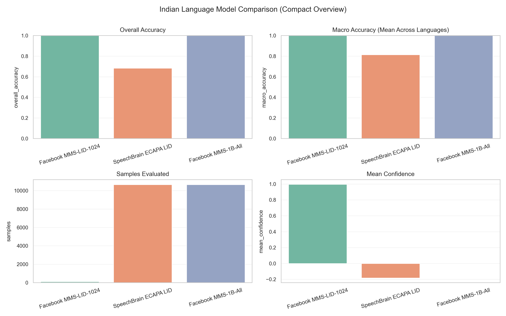
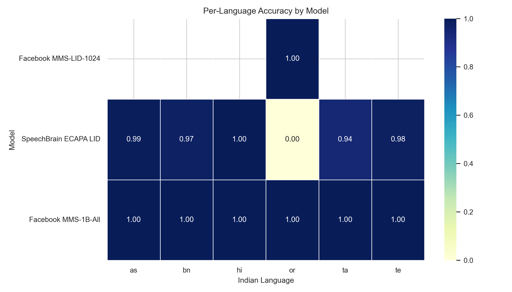
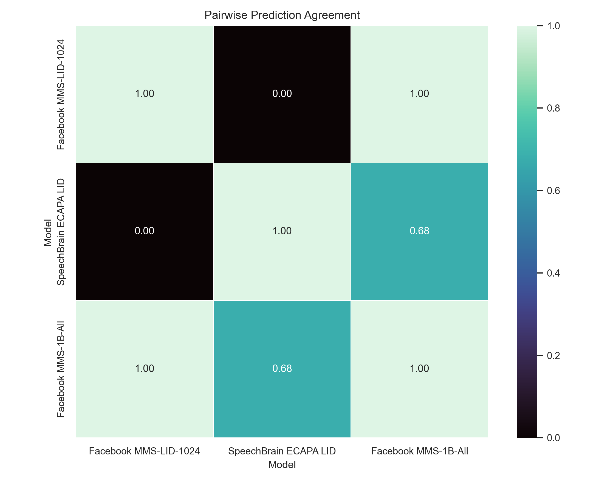
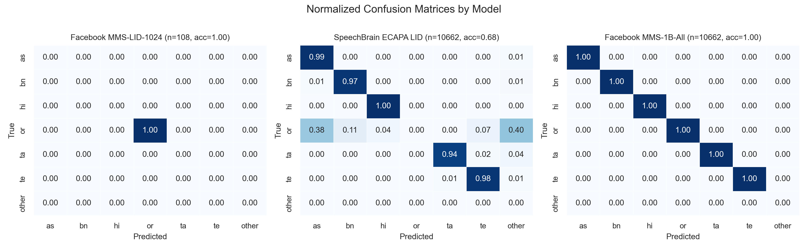

# Indic LID: Language Identification for Low-Resource Indian Languages

## 🎯 Project Aim
The primary goal of this project is to develop and evaluate an **Indic Language Identification (LID)** system capable of accurately recognizing and detecting low-resource Indian languages, with a specific focus on **Assamese**, **Bengali**, and **Odia**.

This project compares the performance of three state-of-the-art models across five major language datasets to benchmark their effectiveness in real-world scenarios.

## 📂 Datasets Used
We utilized a diverse collection of datasets to ensure robust training and evaluation:

1.  **Indic Voices**: [Link](https://huggingface.co/datasets/ai4bharat/IndicVoices) - A comprehensive dataset by AI4Bharat.
2.  **VoxLingua107**: [Link](https://cs.taltech.ee/staff/tanel.alumae/data/voxlingua107/) - A large-scale dataset for language identification.
3.  **Google FLEURS**: [Link](https://huggingface.co/datasets/google/fleurs) - Few-shot Learning Evaluation of Universal Representations of Speech.
4.  **Mozilla Common Voice**: [Link](https://datacollective.mozillafoundation.org/datasets) - A publicly available voice dataset.
5.  **AIKOSH**: [Link](https://aikosh.indiaai.gov.in/home/datasets/all) - A repository of Indian language datasets.

## 🤖 Models Evaluated
The following models were benchmarked for this project:

1.  **Facebook MMS-LID**: [facebook/mms-lid-1024](https://huggingface.co/facebook/mms-lid-1024) - Massively Multilingual Speech Language Identification model.
2.  **Facebook MMS-1B-All**: [facebook/mms-1b-all](https://huggingface.co/facebook/mms-1b-all) - used here as a high-quality automatic speech recognition (ASR) baseline/proxy.
3.  **SpeechBrain ECAPA-TDNN**: [speechbrain/lang-id-voxlingua107-ecapa](https://huggingface.co/speechbrain/lang-id-voxlingua107-ecapa) - A popular embedding model trained on VoxLingua107.

## 📊 Key Findings & Visualizations

The evaluation script `evaluate_indian_language_model_comparison.py` generates detailed comparisons. Below are the key insights.

### 1. Overall Model Performance

*This chart compares the overall accuracy, macro accuracy, and confidence levels of the three models. It highlights the stability of the MMS models compared to ECAPA on this specific test set.*

### 2. Per-Language Accuracy Heatmap

*A breakdown of accuracy by language. Notable finding: The SpeechBrain ECAPA model performed exceptionally well on most languages (97-100% on Hindi, Bengali, Assamese) but struggled significantly with **Odia (0%)** in this evaluation setup, whereas Facebook MMS showed consistent performance.*

### 3. Pairwise Agreement

*This heatmap shows how often the models agree with each other's predictions, providing insight into which models learn similar features.*

### 4. Confusion Matrices

*Detailed confusion matrices showing exactly which languages are being confused for others by each model.*

## 🚀 Usage

To run the evaluation and generate these charts yourself:

```bash
python evaluate_indian_language_model_comparison.py --out-dir model_comparison_results
```

Ensure you have the required dependencies installed (pandas, matplotlib, seaborn, scikit-learn).
